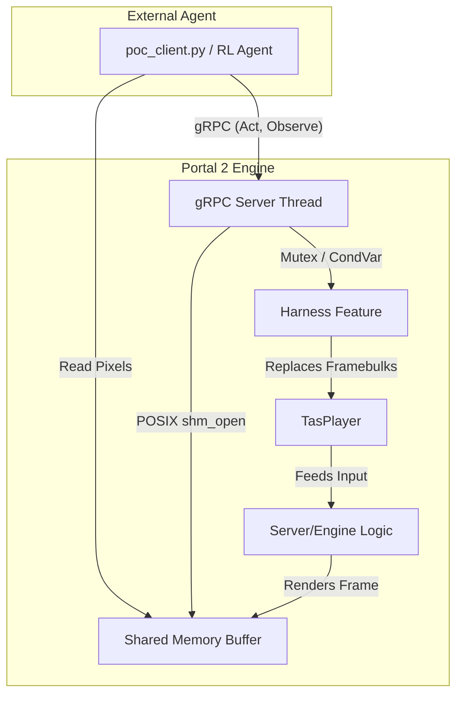

# Portal 2 Harness Architecture Overview

The `Harness` feature in SourceAutoRecord (SAR) acts as a high-performance bridge between the Portal 2 engine and external machine learning agents (such as reinforcement learning models). It exposes game state and control capabilities over a gRPC connection, utilizing POSIX shared memory for efficient pixel streaming and reusing SAR's TAS capabilities to control player actions at the engine level.

## High-Level Architecture

## Key Architectural Components

### Hooking into SAR
The `Harness` class registers as a standard SAR `Feature` and binds to key main-thread events such as `PRE_TICK` and `SESSION_START`.
- When the server starts, `Harness` spawns a background `std::thread` running a gRPC server (`Portal2HarnessImpl`).
- The `PRE_TICK` hook is used to synchronize the game's tick progression with the asynchronous gRPC `Act` calls. A warmup phase allows the game and `TasPlayer` to initialize safely before the Harness asserts control.

### TAS Capabilities Reused
Instead of reinventing engine input injection, Harness relies on SAR's `TasPlayer`. 
- **Sentinel Framebulks:** During initialization (`BuildHarnessPlaybackInfo`), a sentinel framebulk is placed at `INT_MAX/2` to prevent `TasPlayer` from automatically stopping.
- **Action Injection:** When an agent issues an `Act` request, the gRPC implementation updates the inputs in the default tick-0 `TasFramebulk`. `TasPlayer` continuously reads this modified framebulk, effectively bridging remote agent input to in-game actions.

### gRPC Control Loop (`AgentLoop`)
The primary interface for high-performance agent interaction is the bidirectional streaming RPC `AgentLoop`.
- **Sequential Execution:** The loop coordinates actions (`Act`) and observations (`Observe`) sequentially. 
- **Tick Advancement:** The game is paused via `engine->SetAdvancing`. When an `Act` occurs, it dispatches the action to the main thread and instructs the engine to advance by exactly `num_ticks`, blocking the gRPC thread until the `PRE_TICK` handler signals completion via a `std::condition_variable`.

### Shared Memory Architecture
For visual RL tasks, extracting framebuffers over a network socket is too slow.
- **POSIX Shared Memory:** `HarnessShm` sets up POSIX shared memory (`shm_open`) accessible by both the engine and the agent.
- **Engine Rendering:** When `copy_pixels_to_shm` is requested, the gRPC handler dispatches a call to `Offsets::ReadScreenPixels` on the engine's main thread to dump the framebuffer directly into the mapped memory.
- **Synchronization:** The HTTP/2 gRPC stream acts as the implicit synchronization barrier. The engine writes the pixels, responds over gRPC, and the client only reads the shared memory upon receiving the gRPC response.

### Custom Commands (`ExecuteCommand`)
For testing, state manipulation, or environmental configuration, agents can send raw engine console commands via `ExecuteCommand`. These are dispatched to the main thread and executed, safely allowing agents to adjust gravity, give weapons, or change physics parameters dynamically.

---
**See Also:**
- [harness.proto documentation](harness.proto.md)
- [Portal2HarnessImpl.cpp documentation](Portal2HarnessImpl.cpp.md)